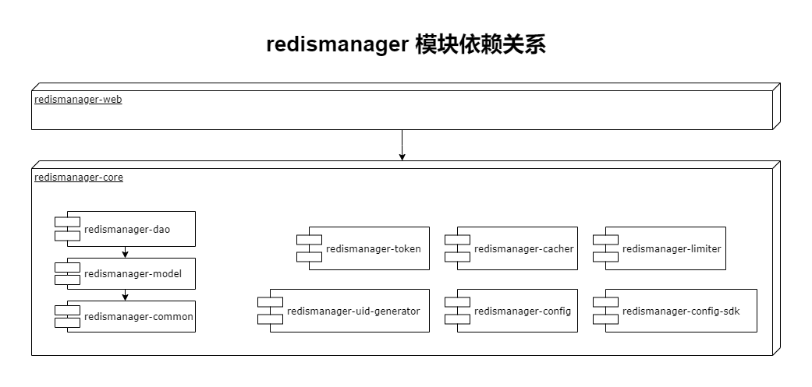
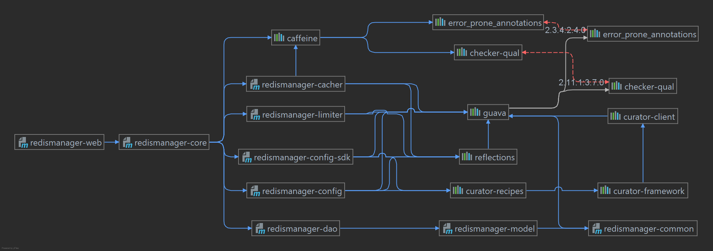
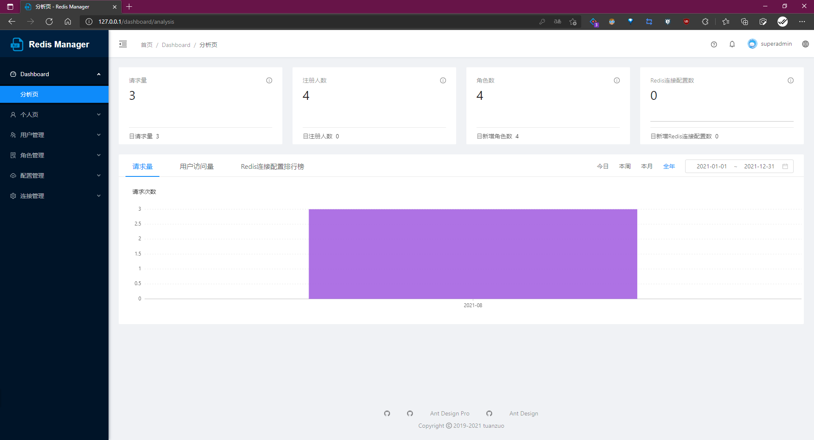
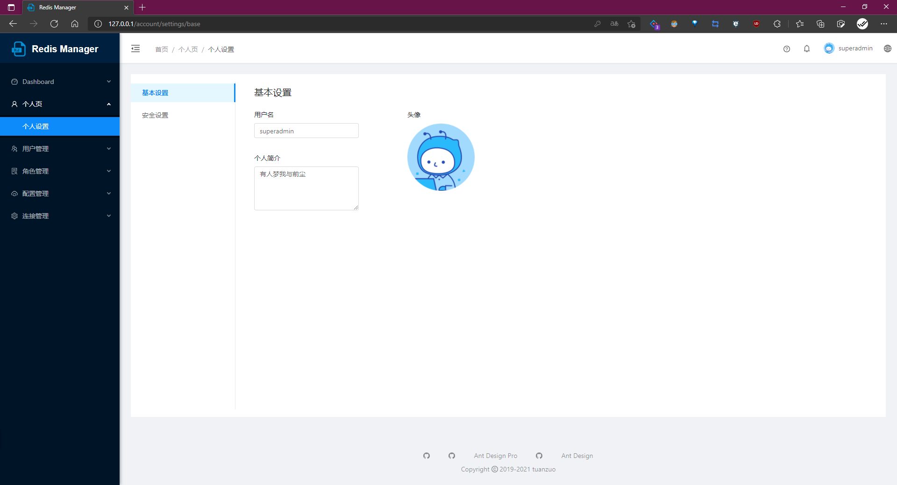
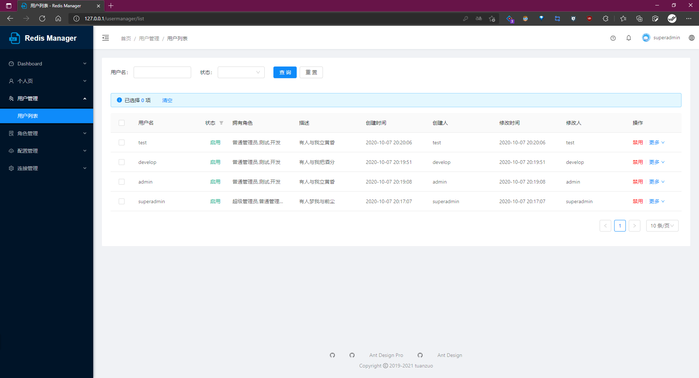
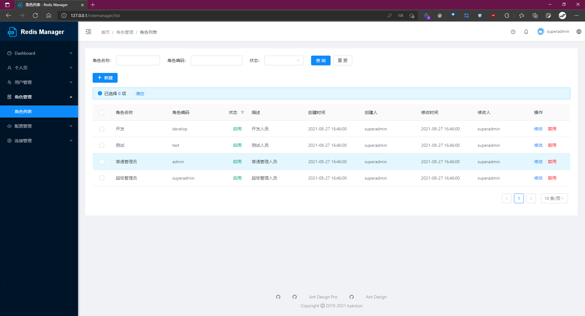
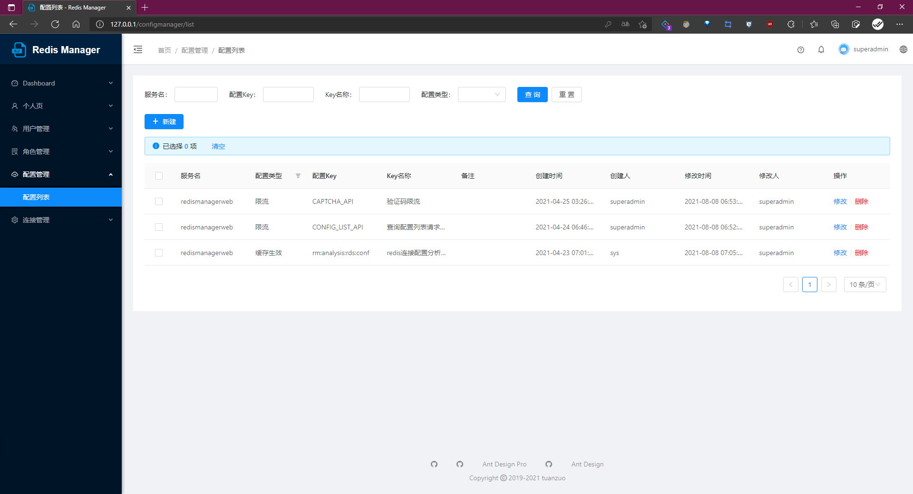
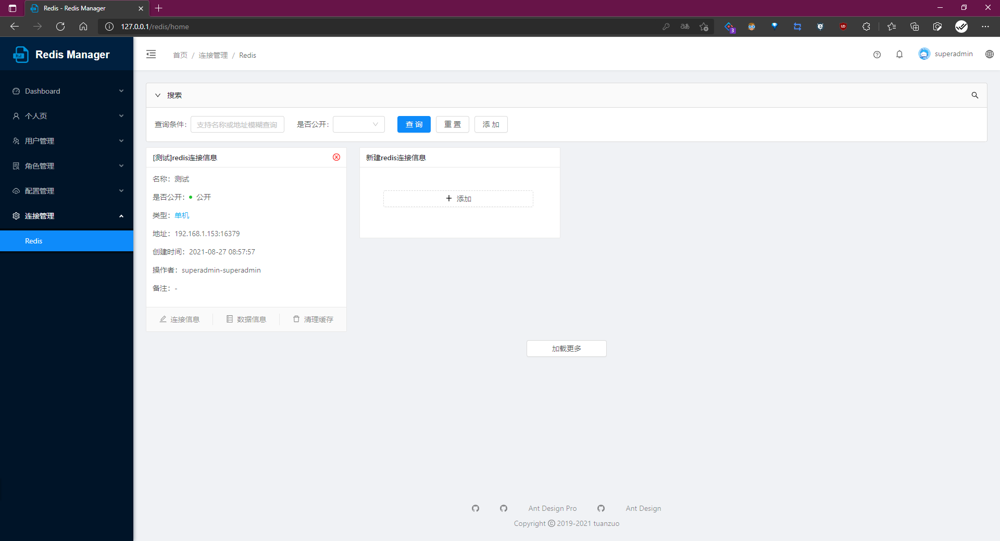
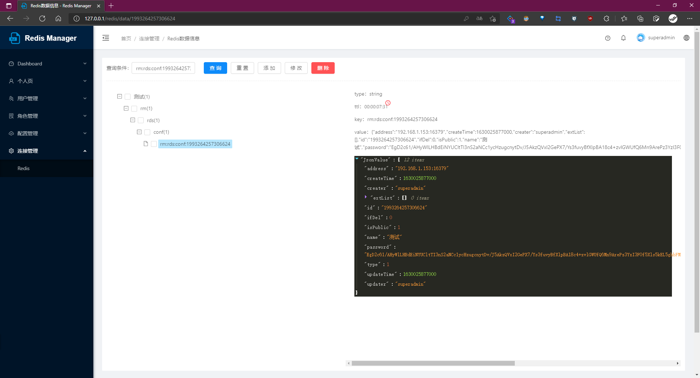

# redismanager

[](https://mvnrepository.com/artifact/org.springframework.boot/spring-boot-starter/2.3.4.RELEASE)
[](https://www.oracle.com/cn/java/technologies/javase/javase-jdk8-downloads.html)
[](https://dev.mysql.com/doc/relnotes/mysql/5.7/en/)
[](https://redis.io)
[](https://zookeeper.apache.org/doc/r3.6.0/index.html)

redismanager 是 Redis **单机** 和 **集群** 下数据的查询，添加，修改，删除；支持自定义 key，value 的序列化方式。

## 模块说明

```text
redismanager/
    ├── redismanager-cacher/
    ├── redismanager-common/
    ├── redismanager-config/
    ├── redismanager-config-sdk/
    ├── redismanager-core/
    ├── redismanager-dao/
    ├── redismanager-limiter/
    ├── redismanager-model/
    ├── redismanager-token/
    ├── redismanager-uid-generator/
    ├── redismanager-web/
    ├── ……
    └── ……
```

### redismanager 模块依赖关系



### redismanager-core 模块依赖



## 构建使用

由于项目使用了 **zookeeper**（<font color="red">版本：3.6.0+
</font>），**redis**（<font color="red">版本：3.0.5+</font>），**mysql**（<font color="red">版本：5.x.x，不支持 8.x.x</font>），因此你需要提前准备好这些环境，这里不再赘述

1. 执行 redismanager/doc/sql/ 路径 `redisadmin-{last-version}.sql` 脚本，初始化数据库
2. 修改 redismanager-web 模板 `config/config-local.properties` 文件中数据库，redis，zookeeper 的连接和配置
3. 启动 redismanager-web 模块中的 RedisManagerWebApplication 类
4. 正常启动后，访问 http://127.0.0.1

> 用户（权限从大到小）: superadmin, admin, develop, test  
> 密码: 888888

## 功能预览

| 仪表盘 | 个人页 |
|:-----------:|:-----------:|
|||
| 用户管理 | 角色管理 |
|||
| 配置管理 | 连接管理 |
|||
| Redis-Operational |  |
|| |

## 贡献指引

## 路线图

## 更新记录

见 [CHANGELOG](CHANGELOG.md) 文件

## 使用协议

```textmate
Copyright 2021 tuanzhuo

Licensed under the Apache License, Version 2.0 (the "License");
you may not use this file except in compliance with the License.
You may obtain a copy of the License at

   https://www.apache.org/licenses/LICENSE-2.0

Unless required by applicable law or agreed to in writing, software
distributed under the License is distributed on an "AS IS" BASIS,
WITHOUT WARRANTIES OR CONDITIONS OF ANY KIND, either express or implied.
See the License for the specific language governing permissions and
limitations under the License.
```